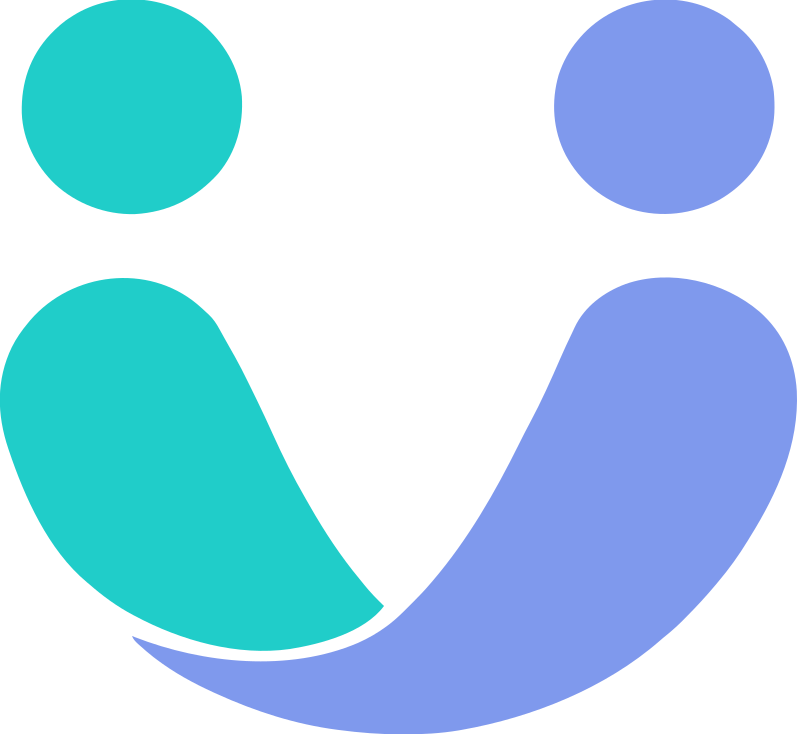

[](https://github.com/IgrowkerTraining/i005-yana-front/actions/workflows/frontend.yaml)

<div align="center">
  
  <br/>
  
</div>

## 🚀 About You are not alone

You Are Not Alone connects people through their emotions to combat unwanted loneliness, offering mutual support and reliable resources in an anonymous and safe space.

## 🔗 Project Resources

<div align="center">

[](https://www.figma.com/design/YPCishcwXKg22v2FFeRUPF/YOUARENOTALONE?node-id=34-11&p=f&t=Jde83WfDARLrzAt4-0)
[](https://github.com/orgs/IgrowkerTraining/projects/33/views/1)
[](https://github.com/IgrowkerTraining/i005-yana-back)

</div>

## 🛠️ Tech Stack

[](https://reactjs.org/)
[](https://www.typescriptlang.org/)
[](https://vitejs.dev/)
[](https://biomejs.dev/)
[](https://mui.com/)
[](https://emotion.sh/)
[](https://zustand-demo.pmnd.rs/)
[](https://tanstack.com/query/latest)
[](https://www.i18next.com/)
[](https://maplibre.org/)

</div>

## 📦 Installation

```bash
# Clone the repository
git clone https://github.com/IgrowkerTraining/i005-yana-front.git

# Navigate to the project directory
cd i005-yana-front

# Install dependencies
npm install

# Copy environment variables
cp .env.example .env

# Start the development server
npm run dev
```

## ⚙️ Environment Variables

Create a `.env` file in the root directory with the following variables:

- `VITE_API_URL`: Base URL for the backend API
- `VITE_MAP_TILES_KEY`: Access token for MapLibre GL map tiles (required for map functionality)

## 🏗️ Project Architecture

```
src/
├── assets/           # Static assets like images, icons, and fonts
├── components/       # Reusable UI components
├── commons/          # Common utilities and shared components
├── config/           # Configuration files and constants
├── hooks/            # Custom React hooks
├── pages/            # Page components and layouts
├── routes/           # Route definitions and navigation logic
├── services/         # API services and data fetching logic
├── store/            # State management with Zustand
├── theme/            # Theme configuration and styling
├── utils/            # Utility functions and helpers
├── App.tsx           # Root application component
├── main.tsx          # Application entry point
├── theme.ts          # Material-UI theme configuration
└── i18n.ts           # Internationalization setup
```
